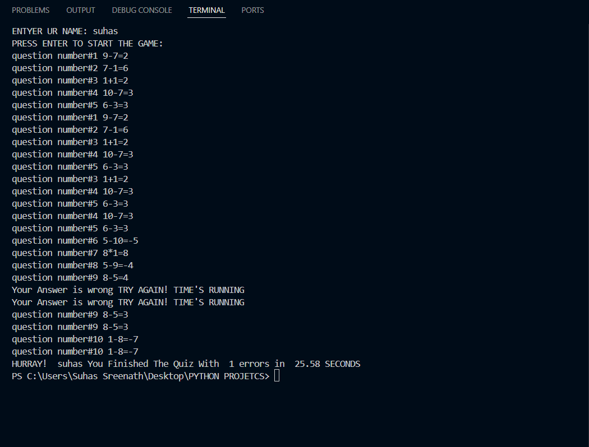

 

# 🧮 Math Quiz Generator

A command-line based math quiz game built using Python.

## 🚀 Features
- Random arithmetic questions using `+`, `-`, `*`
- Tracks number of wrong attempts
- Measures total time to complete the quiz
- Personalized with user's name

## 📸 Demo

