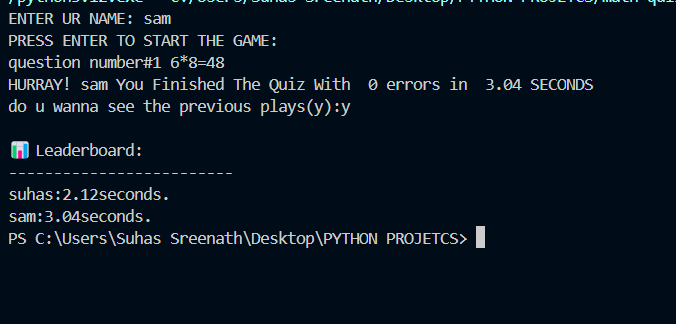

# 🧮 Math Quiz Generator

A Python-based interactive command-line game that tests your basic math skills under pressure. Players answer 10 randomly generated arithmetic questions, and their performance (name and time taken) is stored and displayed on a leaderboard.

---

## 🚀 Features

- 🎲 Randomly generated math problems (`+`, `-`, `*`)
- ⏱️ Timer to track how fast you finish
- ❌ Tracks incorrect attempts
- 🧍 Stores player names and time to `player.txt`
- 🏆 View a leaderboard of past plays
- 🧠 Simple and educational — great for kids, learners, and programmers

---

## 📸 Screenshot



---

## 🧑‍💻 How to Run

```bash
# Clone the repository
git clone https://github.com/suhassiyengar/Math-Quiz-Generator.git

# Navigate to the directory
cd Math-Quiz-Generator

# Run the script
python "math quiz generator.py"


